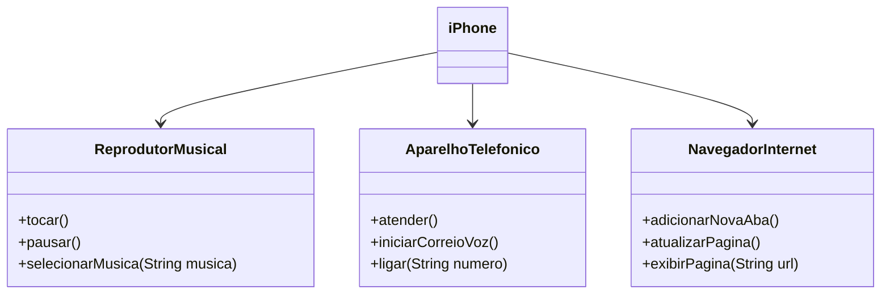

# Java-Basico---Dio
É um repositório para armazenar todos codigos do curso de java basico da Plataforma DIO.

Onde há a Criação da atividade Simulando uma conta bancaria através do Terminal/Console;
criação de um pequeno sistema para validação de processo seletivo;
Modelando o iPhone com UML: Funções de Músicas, Chamadas e Internet e com UML sendo 

Projeto BancoDio é a criação um banco digital em Java, onde teve o objetivo de reforçando os conceitos de Programação Orientada a Objetos como abstração, encapsulamento, herança e polimorfismo. Onde o projeto possui contas correntes e poupanças com funcionalidades de depósito, saque e transferência.

O projeto Abstração em Java, o projeto foi utilizando os pilares da Programação Orientada a Objetos de forma eficiente: abstração para representar cursos e mentorias, encapsulamento para proteger dados e operações, herança para reutilizar código entre classes e polimorfismo para tratar diferentes tipos de conteúdo de maneira uniforme. 

No projeto Design Patterns, implementei o padrão Observer em Java para simular um sistema acadêmico. A classe Disciplina atua como um Subject, notificando os alunos (Aluno) sobre resultados de provas. Cada aluno se inscreve para receber atualizações, promovendo uma comunicação eficiente e desacoplada entre objetos. O padrão permitiu uma estrutura flexível, onde mudanças nos resultados são rapidamente comunicadas aos interessados, exemplificando a aplicação prática e benefícios do design orientado a padrões.
