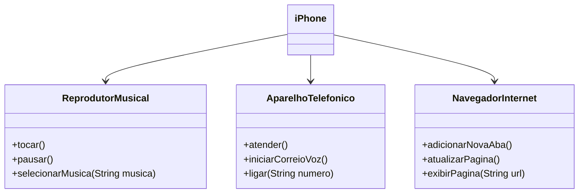

# Java-Basico---Dio
É um repositório para armazenar todos codigos do curso de java basico da Plataforma DIO.

Onde há a Criação da atividade Simulando uma conta bancaria através do Terminal/Console;
criação de um pequeno sistema para validação de processo seletivo;
Modelando o iPhone com UML: Funções de Músicas, Chamadas e Internet e com UML sendo 

Projeto BancoDio é a criação um banco digital em Java, onde teve o objetivo de reforçando os conceitos de Programação Orientada a Objetos como abstração, encapsulamento, herança e polimorfismo. Onde o projeto possui contas correntes e poupanças com funcionalidades de depósito, saque e transferência.
